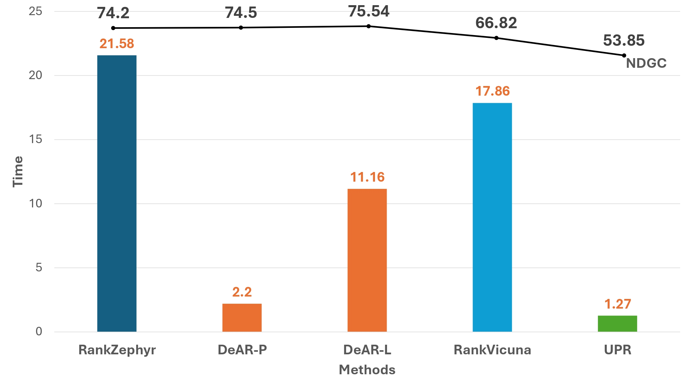

# DeAR: DeAR: Dual-Stage Document Reranking with Reasoning Agents via LLM Distillation

<div align="center">

[](https://huggingface.co/collections/abdoelsayed/dear-reranking)
[](https://huggingface.co/datasets/abdoelsayed/DeAR-COT)
[](https://arxiv.org/)
[](LICENSE)

[**🌐 Homepage**](https://github.com/yourusername/DeAR-Reranking) | 
[**🤗 Models**](https://huggingface.co/collections/abdoelsayed/dear-reranking) | 
[**📊 Dataset**](https://huggingface.co/datasets/abdoelsayed/DeAR-COT) | 
[**📝 Paper**](https://arxiv.org/abs/2508.16998)

</div>

## 📰 News
- **[2025-10]** 🎉 Released DeAR-8B and DeAR-3B rerankers (both pointwise and listwise variants)
- **[2025-10]** 🎉 Released DeAR Chain-of-Thought (CoT) dataset
- **[2025-10]** 🎉 Released teacher model LLaMA2-13B-RankLLaMA
- **[2025-08]** 📝 Paper accepted at EMNLP Findings 2025
- **[2025-08]** 🏆 DeAR achieves 90.97 nDCG@10 on NovelEval, outperforming GPT-4 by +3.09!
- **[2025-08]** ⚡ Inference speedup: 2.2s pointwise, 11.16s listwise

## 🌟 Overview

**DeAR (Distillation Enhanced Adaptive Reranking)** is a suite of high-performance neural rerankers designed to improve information retrieval through knowledge distillation and advanced training techniques. Our models are available in multiple sizes (3B and 8B parameters) and training paradigms (pointwise and listwise), offering flexibility for various deployment scenarios.

### Key Features
- 🎯 **State-of-the-art Performance**: Competitive reranking results on standard benchmarks
- 🔄 **Multiple Training Paradigms**: Both pointwise (Binary Cross-Entropy, RankNet) and listwise approaches
- 📦 **Flexible Deployment**: Full models and efficient LoRA adapters
- 🧠 **Knowledge Distillation**: Leveraging Chain-of-Thought reasoning from teacher models
- 🚀 **Easy Integration**: Simple APIs for both single document scoring and batch reranking

## 🔥 Quick Start

```python
import torch
from transformers import AutoTokenizer, AutoModelForSequenceClassification

# Load model
model_path = "abdoelsayed/dear-8b-reranker-ce-v1"
tokenizer = AutoTokenizer.from_pretrained(model_path)
model = AutoModelForSequenceClassification.from_pretrained(model_path, torch_dtype=torch.bfloat16)
model.eval().cuda()

# Score a query-document pair
query = "What is llama?"
doc = "The llama is a domesticated South American camelid..."
inputs = tokenizer(f"query: {query}", f"document: {doc}", return_tensors="pt", truncation=True, max_length=228)
inputs = {k: v.cuda() for k, v in inputs.items()}

with torch.no_grad():
    score = model(**inputs).logits.squeeze().item()
print(f"Relevance score: {score}")
```

## 📚 Model Zoo

### Teacher Model
| Model | Size | Type | Link |
|-------|------|------|------|
| LLaMA2-RankLLaMA-Teacher | 13B | Teacher | [🤗 Hub](https://huggingface.co/abdoelsayed/llama2-13b-rankllama-teacher) |

### Listwise Rerankers
| Model | Size | Training | Full/LoRA | Link |
|-------|------|----------|-----------|------|
| DeAR-8B-Listwise | 8B | Listwise | Full | [🤗 Hub](https://huggingface.co/abdoelsayed/dear-8b-reranker-listwise-v1) |
| DeAR-8B-Listwise-LoRA | 8B | Listwise | LoRA | [🤗 Hub](https://huggingface.co/abdoelsayed/dear-8b-reranker-listwise-lora-v1) |

### Pointwise Rerankers (8B)
| Model | Size | Loss Function | Full/LoRA | Link |
|-------|------|---------------|-----------|------|
| DeAR-8B-RankNet | 8B | RankNet | Full | [🤗 Hub](https://huggingface.co/abdoelsayed/dear-8b-reranker-ranknet-v1) |
| DeAR-8B-RankNet-LoRA | 8B | RankNet | LoRA | [🤗 Hub](https://huggingface.co/abdoelsayed/dear-8b-reranker-ranknet-lora-v1) |
| DeAR-8B-CE | 8B | Binary Cross-Entropy | Full | [🤗 Hub](https://huggingface.co/abdoelsayed/dear-8b-reranker-ce-v1) |
| DeAR-8B-CE-LoRA | 8B | Binary Cross-Entropy | LoRA | [🤗 Hub](https://huggingface.co/abdoelsayed/dear-8b-reranker-ce-lora-v1) |

### Pointwise Rerankers (3B)
| Model | Size | Loss Function | Full/LoRA | Link |
|-------|------|---------------|-----------|------|
| DeAR-3B-RankNet | 3B | RankNet | Full | [🤗 Hub](https://huggingface.co/abdoelsayed/dear-3b-reranker-ranknet-v1) |
| DeAR-3B-RankNet-LoRA | 3B | RankNet | LoRA | [🤗 Hub](https://huggingface.co/abdoelsayed/dear-3b-reranker-ranknet-lora-v1) |
| DeAR-3B-CE | 3B | Binary Cross-Entropy | Full | [🤗 Hub](https://huggingface.co/abdoelsayed/dear-3b-reranker-ce-v1) |
| DeAR-3B-CE-LoRA | 3B | Binary Cross-Entropy | LoRA | [🤗 Hub](https://huggingface.co/abdoelsayed/dear-3b-reranker-ce-lora-v1) |

### Dataset
| Resource | Description | Link |
|----------|-------------|------|
| DeAR-COT Dataset | Chain-of-Thought reasoning data for reranker training | [🤗 Hub](https://huggingface.co/datasets/abdoelsayed/DeAR-COT) |

## 🛠️ Installation

### Requirements
```bash
rankify[all]
pyserini==0.22.1
```

### Install Dependencies
```bash
pip install torch transformers peft accelerate
pip install pyserini==0.22.1
```

### Clone Repository
```bash
git clone https://github.com/yourusername/DeAR-Reranking.git
cd DeAR-Reranking
pip install -r requirements.txt
```

## 🚀 Usage

### Pointwise Rerankers

#### Basic Usage

```python
import torch
from typing import List, Tuple
from transformers import AutoTokenizer, AutoModelForSequenceClassification
from peft import PeftModel, PeftConfig

DTYPE = {
    "auto": None,
    "float16": torch.float16,
    "bfloat16": torch.bfloat16,
    "float32": torch.float32,
}

def load_ranker(model_or_adapter_path: str, torch_dtype: str = "auto", device: str = "auto"):
    """
    Load either a PEFT LoRA adapter or a merged/original model.
    
    Args:
        model_or_adapter_path: Path to PEFT adapter dir/HF repo OR merged model dir/HF repo
        torch_dtype: Data type for model weights ("auto", "float16", "bfloat16", "float32")
        device: Device to load model on ("auto", "cuda", "cpu")
    
    Returns:
        tokenizer, model, device_str
    """
    dtype = DTYPE[torch_dtype]

    # Try to interpret as a PEFT adapter first
    is_peft = False
    peft_cfg = None
    try:
        peft_cfg = PeftConfig.from_pretrained(model_or_adapter_path)
        is_peft = True
    except Exception:
        is_peft = False

    if is_peft:
        # Load LoRA adapter
        base_id = peft_cfg.base_model_name_or_path
        tok = AutoTokenizer.from_pretrained(base_id)
        if tok.pad_token is None:
            tok.pad_token = tok.eos_token
            tok.pad_token_id = tok.eos_token_id
        tok.padding_side = "right"

        base = AutoModelForSequenceClassification.from_pretrained(
            base_id, num_labels=1, torch_dtype=dtype
        )
        model = PeftModel.from_pretrained(base, model_or_adapter_path)
        model = model.merge_and_unload()
    else:
        # Load merged/original model
        tok = AutoTokenizer.from_pretrained(model_or_adapter_path)
        if tok.pad_token is None:
            tok.pad_token = tok.eos_token
            tok.pad_token_id = tok.eos_token_id
        tok.padding_side = "right"

        model = AutoModelForSequenceClassification.from_pretrained(
            model_or_adapter_path, torch_dtype=dtype
        )

    model.eval()

    # Configure tokenizer IDs for LLaMA-style models
    if getattr(model.config, "pad_token_id", None) is None:
        model.config.pad_token_id = tok.pad_token_id
    if getattr(model.config, "bos_token_id", None) is None and tok.bos_token_id is not None:
        model.config.bos_token_id = tok.bos_token_id
    if getattr(model.config, "eos_token_id", None) is None and tok.eos_token_id is not None:
        model.config.eos_token_id = tok.eos_token_id

    if device == "auto":
        device = "cuda" if torch.cuda.is_available() else "cpu"
    model.to(device)

    return tok, model, device


@torch.inference_mode()
def score_pair(tokenizer, model, device, query: str, passage: str, title: str = "",
               q_max_len: int = 32, p_max_len: int = 196) -> float:
    """Score a single query-document pair."""
    inputs = tokenizer(
        f"query: {query}",
        f"document: {title} {passage}",
        return_tensors="pt",
        truncation=True,
        max_length=q_max_len + p_max_len,
        padding="max_length",
        return_attention_mask=True,
    )
    inputs = {k: v.to(device) for k, v in inputs.items()}
    logits = model(**inputs).logits
    return float(logits.squeeze().item())


@torch.inference_mode()
def rerank(tokenizer, model, device, query: str, docs: List[Tuple[str, str]],
           q_max_len: int = 32, p_max_len: int = 196, batch_size: int = 64):
    """
    Rerank a list of documents for a given query.
    
    Args:
        docs: List of (title, passage) tuples
    
    Returns:
        List of (index, score) tuples sorted by score (descending)
    """
    scores = []
    for i in range(0, len(docs), batch_size):
        chunk = docs[i:i + batch_size]
        q_texts = [f"query: {query}"] * len(chunk)
        d_texts = [f"document: {t} {p}" for t, p in chunk]
        inputs = tokenizer(
            q_texts, d_texts,
            return_tensors="pt",
            truncation=True,
            padding=True,
            max_length=q_max_len + p_max_len,
            return_attention_mask=True,
        )
        inputs = {k: v.to(device) for k, v in inputs.items()}
        logits = model(**inputs).logits.squeeze(-1)
        scores.extend(logits.detach().cpu().tolist())
    ranked = sorted(enumerate(scores), key=lambda x: x[1], reverse=True)
    return ranked
```

#### Example: Single Pair Scoring

```python
# Load model (either full model or LoRA adapter)
model_path = "abdoelsayed/dear-8b-reranker-ce-v1"
tokenizer, model, device = load_ranker(model_path, torch_dtype="bfloat16")

# Score a single query-document pair
query = "What is llama?"
title = "Llama"
passage = "The llama is a domesticated South American camelid..."
score = score_pair(tokenizer, model, device, query, passage, title)
print(f"Relevance score: {score}")
```

#### Example: Batch Reranking

```python
# Rerank multiple documents for a query
query = "When did Thomas Edison invent the light bulb?"
docs = [
    ("", "Lightning strike at Seoul National University"),
    ("", "Thomas Edison tried to invent a device for car but failed"),
    ("", "Coffee is good for diet"),
    ("", "KEPCO fixes light problems"),
    ("", "Thomas Edison invented the light bulb in 1879"),
]

ranking = rerank(tokenizer, model, device, query, docs)
print(ranking)

# Expected output (example for DeAR-8B-CE):
# [(4, -2.015625), (1, -5.6875), (2, -6.375), (0, -6.5), (3, -6.78125)]
```


### Listwise Rerankers

Listwise rerankers process multiple documents simultaneously and generate rankings through language generation.

#### Basic Usage with LoRA Adapter

```python
import torch
from transformers import AutoTokenizer
from peft import AutoPeftModelForCausalLM

adapter_repo = "abdoelsayed/dear-8b-reranker-listwise-lora-v1"
dtype = torch.bfloat16 if torch.cuda.is_bf16_supported() else torch.float16

tokenizer = AutoTokenizer.from_pretrained(adapter_repo, use_fast=True, trust_remote_code=True)

# Load model with device map (recommended)
model = AutoPeftModelForCausalLM.from_pretrained(
    adapter_repo,
    torch_dtype=dtype,
    device_map="auto",  # Automatically distributes model across available GPUs
    trust_remote_code=True,
    low_cpu_mem_usage=True
)

if tokenizer.pad_token is None:
    tokenizer.pad_token = tokenizer.eos_token
```


#### Reranking with Listwise Model

```python
def create_listwise_prompt(query: str, documents: List[str], max_length: int = 300) -> str:
    """Create prompt for listwise reranking."""
    doc_list = "\n".join([f"[{i}] {doc[:max_length]}" for i, doc in enumerate(documents)])
    prompt = f"""I will provide you with {len(documents)} passages, each indicated by a number identifier [].
Rank the passages based on their relevance to the search query: {query}.

{doc_list}

Search Query: {query}.
Rank the passages above based on their relevance to the search query. Output the ranking as a list of numbers."""
    return prompt

# Example usage
query = "When did Thomas Edison invent the light bulb?"
documents = [
    "Lightning strike at Seoul National University",
    "Thomas Edison tried to invent a device for car but failed",
    "Coffee is good for diet",
    "KEPCO fixes light problems",
    "Thomas Edison invented the light bulb in 1879",
]

prompt = create_listwise_prompt(query, documents)
inputs = tokenizer(prompt, return_tensors="pt", truncation=True, max_length=2048)
inputs = {k: v.to(model.device) for k, v in inputs.items()}

# Generate ranking
with torch.no_grad():
    outputs = model.generate(
        **inputs,
        max_new_tokens=50,
        temperature=0.7,
        do_sample=False,
        pad_token_id=tokenizer.pad_token_id
    )

ranking_text = tokenizer.decode(outputs[0][inputs['input_ids'].shape[1]:], skip_special_tokens=True)
print(f"Ranking: {ranking_text}")
# Expected output: [4] > [1] > [0] > [3] > [2]
```


## 🏋️ Training

### Dataset Preparation

The DeAR models are trained on the [DeAR-COT dataset](https://huggingface.co/datasets/abdoelsayed/DeAR-COT), which contains Chain-of-Thought reasoning annotations from the GPT-4o.

### Training Scripts

### 🎯 Pointwise Training

Train pointwise rerankers with knowledge distillation from the teacher model:

```bash
# Example training command with DeepSpeed
deepspeed --include localhost:0,1,2,3 reranker_train.py \
  --deepspeed ./config/ds_config.json \
  --output_dir ./models/llama8 \
  --model_name_or_path meta-llama/Llama-3.1-8B \
  --teacher_model_name_or_path abdoelsayed/llama2-13b-rankllama-teacher \
  --temperature 2 \
  --alpha 0.1 \
  --save_steps 200 \
  --dataset_name Tevatron/msmarco-passage \
  --bf16 \
  --per_device_train_batch_size 2 \
  --gradient_accumulation_steps 2 \
  --train_n_passages 2 \
  --learning_rate 1e-4 \
  --q_max_len 32 \
  --p_max_len 196 \
  --num_train_epochs 2 \
  --logging_steps 10 \
  --overwrite_output_dir \
  --dataset_proc_num 32
```

Or use the training script:

```bash
bash train_pointwise.sh
```

### 🧠 Listwise Training (with LLaMA-Factory)

We train listwise CoT models using [LLaMA-Factory](https://github.com/hiyouga/LLaMA-Factory) for multi-node/multi-GPU training via `torch.distributed.run`.

#### 1. Register the CoT Dataset

Add [DeAR-CoT](https://huggingface.co/datasets/abdoelsayed/DeAR-COT) into LLaMA-Factory's `data/` directory and update the dataset config file.

#### 2. Run Training

Using our helper script:

```bash
bash train_listwise.sh
```

Or configure your own LLaMA-Factory training command. We use `torch.distributed.run` for multi-node/multi-GPU distributed training.
## 📊 Evaluation

### Download BM25 Outputs (BEIR + DL19/20)

We provide pre-computed BM25 outputs for reproducible second-stage reranking evaluation. Download and extract to the `data/` directory:

```bash
# Download BM25 outputs for BEIR and DL19/20
wget -L 'https://www.dropbox.com/scl/fi/2ryyzvht45fazrjjuetgk/bm25_beir_dl19_20.zip?rlkey=e3li5e26n12iuq2zrp61ti5tq&st=xnic6wvp&dl=1' -O bm25_beir_dl19_20.zip

# Extract to data directory
unzip bm25_beir_dl19_20.zip -d data

# Final path structure: data/bm25_beir_dl19_20/...
```

### Run Evaluation

#### Pointwise Reranking

Evaluate pointwise models on BEIR and TREC DL19/20:

```bash
bash run_pointwise.sh
```

#### Listwise Reranking

Evaluate listwise models on BEIR and TREC DL19/20:

```bash
bash run_listwise.sh
```

## 📊 Results

### Main Benchmarks (nDCG@10)

#### TREC Deep Learning
| Method | DL19 | DL20 | Avg |
|--------|------|------|-----|
| BM25 | 50.58 | 47.96 | 49.27 |
| MonoT5-3B | 71.83 | 68.89 | 70.36 |
| RankGPT-4 | 75.59 | 70.56 | 73.08 |
| **DeAR-L-8B** | **77.91** | **75.63** | **76.77** |

#### BEIR Datasets (Average nDCG@10)
| Method | Covid | NFCorpus | Touche | DBPedia | SciFact | News | Robust04 | Signal |
|--------|-------|----------|---------|---------|---------|------|----------|--------|
| BM25 | 59.47 | 30.75 | 44.22 | 31.80 | 67.89 | 39.52 | 40.70 | 33.05 |
| MonoT5-3B | 80.71 | 38.97 | 32.41 | 44.45 | 76.57 | 48.49 | 56.71 | 32.55 |
| **DeAR-L-8B** | **88.36** | **40.56** | **37.23** | **47.12** | **74.95** | **52.89** | **62.18** | **34.40** |

#### NovelEval-2306 (Novel Query Generalization)
| Method | nDCG@1 | nDCG@5 | nDCG@10 | Avg |
|--------|--------|--------|---------|-----|
| BM25 | 33.33 | 45.96 | 55.77 | 45.02 |
| RankGPT-4 | 85.71 | 87.49 | 90.45 | 87.88 |
| **DeAR-L-8B** | **92.86** | **88.04** | **92.01** | **90.97** |

### Efficiency Analysis
<div align="center">

<p><em>Inference time vs. nDCG@10 performance on TREC DL19</em></p>
</div>

| Method | nDCG@10 | Time (s) | Speed Rank |
|--------|---------|----------|------------|
| **DeAR-P-8B** | 74.5 | 2.2 | 🥈 |
| **DeAR-L-8B** | 75.54 | 11.16 | ⚡ |
| RankZephyr | 74.2 | 21.58 | 🐌 |
| RankVicuna | 66.82 | 17.86 | 🐌 |


## 🔬 Model Architecture

DeAR rerankers are built on top of large language models (LLaMA-2-3B/8B) with the following modifications:

- **Pointwise Models**: Add a classification head on top of the base model for scoring individual query-document pairs
- **Listwise Models**: Use the generative capabilities of LLMs to produce rankings through text generation
- **Knowledge Distillation**: Leverage Chain-of-Thought reasoning from a 13B teacher model (LLaMA2-RankLLaMA)

## 📖 Dataset

The [DeAR-COT dataset](https://huggingface.co/datasets/abdoelsayed/DeAR-COT) contains:
- Query-document pairs with relevance annotations
- Chain-of-Thought reasoning from the teacher model
- Training data for both pointwise and listwise rerankers

```python
from datasets import load_dataset

# Load dataset
dataset = load_dataset("abdoelsayed/DeAR-COT")

# Example data point
print(dataset['train'][0])
```

## 🤝 Contributing

We welcome contributions! Please feel free to submit a Pull Request. For major changes, please open an issue first to discuss what you would like to change.


## 📚 Citation

If you use DeAR in your research, please cite our paper:

```bibtex
@article{abdallah2025dear,
  title={DeAR: Dual-Stage Document Reranking with Reasoning Agents via LLM Distillation},
  author={Abdallah, Abdelrahman and Mozafari, Jamshid and Piryani, Bhawna and Jatowt, Adam},
  journal={arXiv preprint arXiv:2508.16998},
  year={2025}
}
```

## 🙏 Acknowledgements

We thank the following projects and their contributors:
- [LLaMA](https://github.com/facebookresearch/llama) for the base models
- [PEFT](https://github.com/huggingface/peft) for efficient fine-tuning
- [Transformers](https://github.com/huggingface/transformers) for the modeling infrastructure
- [RankLLaMA](https://github.com/rankllama/rankllama) for inspiring our teacher model design
- [Tevatron](https://github.com/texttron/tevatron)  Unified Document Retrieval Toolkit across Scale, Language, and Modality. 

---

<div align="center">

**[🔝 Back to Top](#dear-distillation-enhanced-adaptive-reranking)**

Made with ❤️ by the DISC Team

</div>
