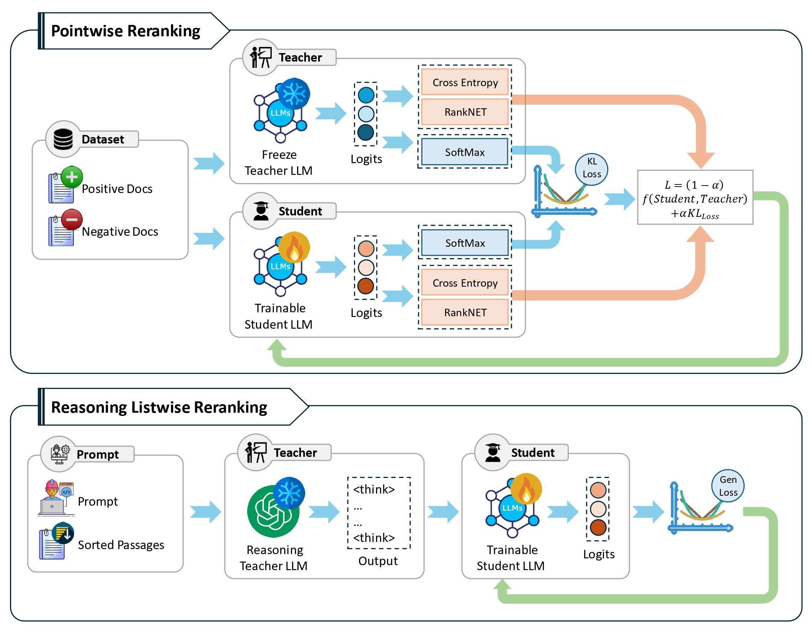
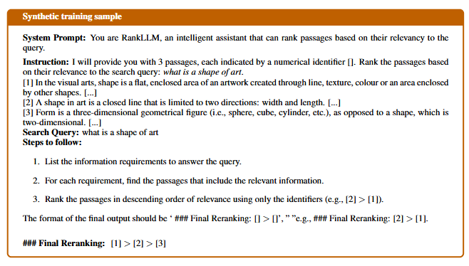
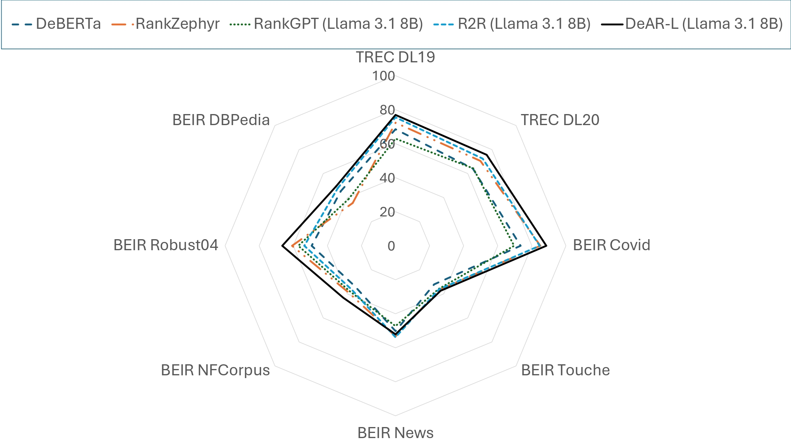
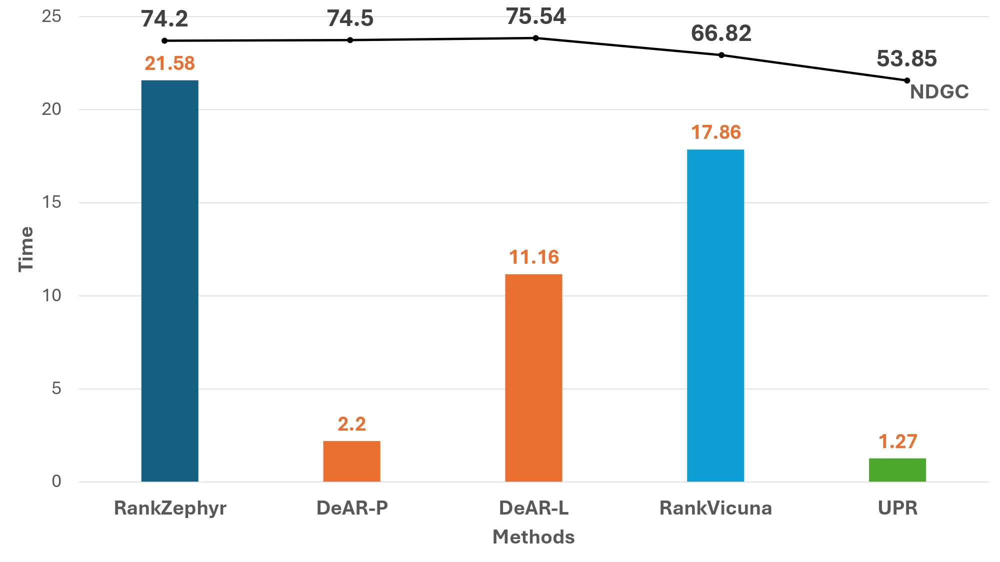

# DeAR: Dual-Stage Document Reranking with Reasoning Agents 🎯

<div align="center">
  <a href="https://arxiv.org/abs/2508.16998">
    
  </a>
  <a href="https://github.com/DataScienceUIBK/DeAR-Reranking">
    
  </a>
  <a href="#datasets">
    
  </a>
  <a href="https://huggingface.co/collections/your-username/dear-models">
    
  </a>
  <a href="#">
    
  </a>
</div>

<div align="center" style="font-family: Arial, sans-serif;">
  <p>
    <a href="#news" style="text-decoration: none; font-weight: bold;">🎉 News</a> •
    <a href="#introduction" style="text-decoration: none; font-weight: bold;">📖 Introduction</a> •
    <a href="#methodology" style="text-decoration: none; font-weight: bold;">🔬 Methodology</a>
  </p>
  <p>
    <a href="#installation" style="text-decoration: none; font-weight: bold;">🚀 Installation</a> •
    <a href="#results" style="text-decoration: none; font-weight: bold;">📊 Results</a> •
    <a href="#citation" style="text-decoration: none; font-weight: bold;">🎈 Citation</a>
  </p>
</div>

# 🎉 News
- **[2025-08-23]** 📝 Paper accepted at EMNLP Findings 2025
- **[2025-08-23]** 🏆 **DeAR achieves 90.97 nDCG@10 on NovelEval**, outperforming GPT-4 by +3.09!
- **[2025-08-23]** ⚡ Inference speedup: 2.2s pointwise, 11.16s listwise

# 📖 Introduction

**DeAR** (**De**ep **A**gent **R**ank) is a novel dual-stage document reranking framework that decouples fine-grained relevance scoring from holistic cross-document analysis. By combining **knowledge distillation** with **reasoning agents**, DeAR achieves superior accuracy and interpretability compared to single-stage approaches.

<div align="center">

<p><em>Overview of the DeAR dual-stage training pipeline</em></p>
</div>

## 🎯 Key Features
- **🧠 Dual-Stage Architecture**: Pointwise scoring + Listwise reasoning
- **📚 Knowledge Distillation**: Transfer from 13B teacher to 3B/8B students  
- **🤖 Reasoning Agents**: Chain-of-Thought guided reranking
- **⚡ Efficient Training**: LoRA adapters for lightweight fine-tuning
- **🏆 SOTA Performance**: Surpasses GPT-4 on multiple benchmarks
- **🔓 Open Source**: No proprietary API dependencies

## 🔥 Performance Highlights
| Dataset | DeAR-L | GPT-4 | Improvement |
|---------|--------|-------|-------------|
| **NovelEval** | 90.97 | 87.88 | **+3.09** |
| **DL20** | 68.71 | - | **+5.1** vs baselines |
| **Natural Questions** | 54.29 | - | **SOTA** |
| **Covid** | 88.36 | 85.51 | **+2.85** |

# 🔬 Methodology

## Stage 1: Pointwise Reranking with KL Distillation
- **Teacher**: Frozen 13B LLaMA model generates relevance logits
- **Student**: Compact {3B, 8B} models learn via hybrid loss:
  - Cross-Entropy Loss (ranking objective)
  - RankNet Loss (pairwise preferences)  
  - KL Divergence Loss (teacher alignment)
- **Output**: Top-100 ranked candidates

## Stage 2: Listwise Reranking with Reasoning
- **Synthetic Data**: 20K GPT-4o generated reasoning examples
- **Chain-of-Thought**: Step-by-step ranking explanations
- **Training**: Supervised fine-tuning on top-20 candidates
- **Output**: Final interpretable ranking with justifications

### 📝 Synthetic Training Example
<div align="center">

<p><em>Example of RankLLM training prompt used to generate synthetic reasoning data. The model follows structured steps: (1) identify information requirements, (2) match passages to requirements, (3) provide final ranking with reasoning.</em></p>
</div>

<div align="center">

<p><em>nDCG@5 performance across TREC DL19 and BEIR datasets</em></p>
</div>

# 🚀 Installation

## Quick Start
```bash
git clone https://github.com/your-username/DeAR-Reranking.git
cd DeAR-Reranking
pip install -r requirements.txt
```

## Environment Setup
```bash
```

## Model Downloads
```bash
```

# 🔧 Usage

## Pointwise Reranking (Stage 1)
```python
```

## Listwise Reranking (Stage 2)
```python
```

## End-to-End Pipeline
```bash
```

## Training Your Own Models

### Stage 1: Pointwise Training
```bash

```

### Stage 2: Listwise Training  
```bash
```

### Generate Synthetic Reasoning Data
```bash
```

The generation process follows the structured prompt format shown in the figure above, ensuring consistent reasoning patterns across all synthetic examples.

# 📊 Results

## Main Benchmarks (nDCG@10)

### TREC Deep Learning
| Method | DL19 | DL20 | Avg |
|--------|------|------|-----|
| BM25 | 50.58 | 47.96 | 49.27 |
| MonoT5-3B | 71.83 | 68.89 | 70.36 |
| RankGPT-4 | 75.59 | 70.56 | 73.08 |
| **DeAR-L-8B** | **77.91** | **75.63** | **76.77** |

### BEIR Datasets (Average nDCG@10)
| Method | Covid | NFCorpus | Touche | DBPedia | SciFact | News | Robust04 | Signal |
|--------|-------|----------|---------|---------|---------|------|----------|--------|
| BM25 | 59.47 | 30.75 | 44.22 | 31.80 | 67.89 | 39.52 | 40.70 | 33.05 |
| MonoT5-3B | 80.71 | 38.97 | 32.41 | 44.45 | 76.57 | 48.49 | 56.71 | 32.55 |
| **DeAR-L-8B** | **88.36** | **40.56** | **37.23** | **47.12** | **74.95** | **52.89** | **62.18** | **34.40** |

### NovelEval-2306 (Novel Query Generalization)
| Method | nDCG@1 | nDCG@5 | nDCG@10 | Avg |
|--------|--------|--------|---------|-----|
| BM25 | 33.33 | 45.96 | 55.77 | 45.02 |
| RankGPT-4 | 85.71 | 87.49 | 90.45 | 87.88 |
| **DeAR-L-8B** | **92.86** | **88.04** | **92.01** | **90.97** |

## Efficiency Analysis
<div align="center">

<p><em>Inference time vs. nDCG@10 performance on TREC DL19</em></p>
</div>

| Method | nDCG@10 | Time (s) | Speed Rank |
|--------|---------|----------|------------|
| **DeAR-P-8B** | 74.5 | 2.2 | 🥈 |
| **DeAR-L-8B** | 75.54 | 11.16 | ⚡ |
| RankZephyr | 74.2 | 21.58 | 🐌 |
| RankVicuna | 66.82 | 17.86 | 🐌 |


# 🗂️ Datasets

## Training Data
- **MS MARCO**: Pointwise distillation (40K queries)
- **Synthetic Reasoning**: GPT-4o generated CoT examples (20K)

### Synthetic Data Generation Process
We generate 20K high-quality reasoning examples using the structured prompt shown above. Each example contains:
- **Query**: Original search query
- **Documents**: Top candidate passages with IDs [1], [2], [3]...  
- **Reasoning Steps**: Step-by-step CoT explanation
- **Final Ranking**: Structured output format `### Final Reranking: [1] > [2] > [3]`

The prompt guides GPT-4o to:
1. **List information requirements** for the query
2. **Match passages** to these requirements  
3. **Provide final ranking** using document identifiers

## Evaluation Benchmarks
- **TREC DL19/20**: Deep Learning tracks
- **BEIR**: 8 diverse retrieval datasets
- **NovelEval-2306**: Novel query generalization
- **Natural Questions & WebQA**: Open-domain QA


## Ways to Contribute
- 🐛 Bug fixes and improvements
- 📈 New evaluation benchmarks  
- 🧠 Alternative reasoning strategies
- ⚡ Performance optimizations
- 📚 Documentation improvements

# 📋 Model Variants

## Available Models
| Model | Parameters | Stage | Performance | Speed |
|-------|------------|-------|-------------|--------|
| DeAR-3B-P | 3B | Pointwise | High | Very Fast |
| DeAR-8B-P | 8B | Pointwise | Higher | Fast |
| DeAR-3B-L | 3B | Listwise | Very High | Moderate |
| DeAR-8B-L | 8B | Listwise | Highest | Moderate |

## Model Downloads
```bash
```


# 📈 Leaderboard

Track the latest results on our community leaderboard:
🏆 [DeAR Leaderboard]() *(Coming Soon)*


# 🎈 Citation

If you use DeAR in your research, please cite our paper:

```bibtex
@misc{abdallah2025dear,
    title={DeAR: Dual-Stage Document Reranking with Reasoning Agents via LLM Distillation},
    author={Abdelrahman Abdallah and Jamshid Mozafari and Bhawna Piryani and Adam Jatowt},
    year={2025},
    eprint={2508.16998},
    archivePrefix={arXiv},
    primaryClass={cs.CL}
}
```

# 📞 Contact & Support

- **Authors**: [Abdelrahman Abdallah](mailto:abdelrahman.abdallah@uibk.ac.at), [Jamshid Mozafari](mailto:jamshid.mozafari@uibk.ac.at)
- **Institution**: University of Innsbruck
- **Issues**: [GitHub Issues](https://github.com/your-username/DeAR-Reranking/issues)
- **Discussions**: [GitHub Discussions](https://github.com/your-username/DeAR-Reranking/discussions)

---

<div align="center">
<p><strong>🌟 Star this repo if DeAR helps your research! 🌟</strong></p>
<p>📧 Questions? Open an issue or contact the authors</p>
<p>🔗 Follow us for updates: <a href="https://twitter.com/your-handle">@YourHandle</a></p>
</div>
